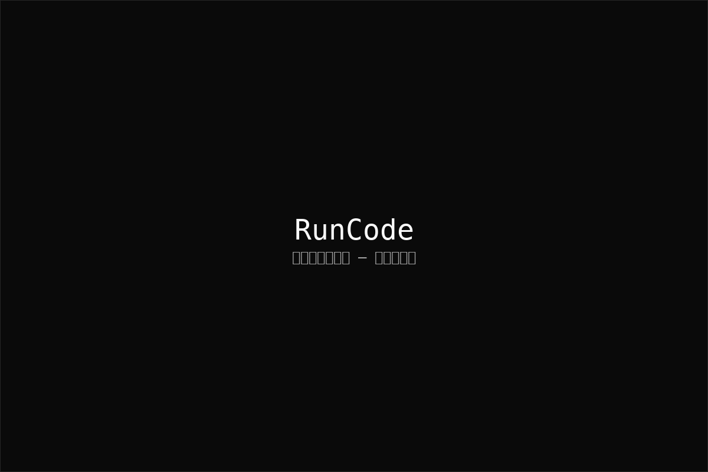
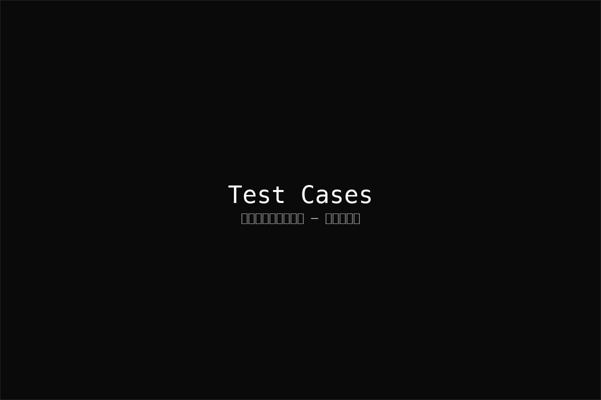

# RunCode

> 轻量级 macOS 原生 C++ 教学编辑器，专为 OI / 算法教学场景设计


## 特性

- **原生 macOS 体验** — Tauri 2 + Rust，无 Electron 包袱，体积小启动快
- **Monaco 编辑器** — VS Code 同款，教学友好的语法高亮 / 括号补全
- **多样例测试** — 一次性运行多组样例，支持 stdin / expected 文件导入
- **时间限制判定** — 单例超时判失败（OI 友好，默认 1000ms，可配置）
- **实时终端** — PTY 终端支持交互式输入
- **代码格式化** — tree-sitter 解析 + 内置 formatter
- **Lyra 全直角风格** — 中性灰配色，UI 与代码统一 JetBrains Mono
- **中英文界面切换** — 编辑器界面支持中 / 英双语
- **主题切换** — Dark / Light / System 跟随系统
- **可折叠面板** — 左右 / 上下分栏自由切换

## 截图




> 截图为占位图，可手动替换 `docs/images/main.png` 和 `docs/images/tests.png` 为真实截图。

## 快速开始

```bash
pnpm install
pnpm tauri dev
```

要求：macOS 11+、Node.js 20.19+ 或 22.12+、pnpm、Rust toolchain（rustup）、Xcode Command Line Tools。

## 构建

```bash
# Ad-hoc 签名（开发用）
./scripts/build-dev.sh

# Developer ID 正式签名 + 公证
./scripts/build-signed.sh
```

详见 [SIGNING.md](./SIGNING.md)。

## 文档

- [macOS 签名与公证配置](./SIGNING.md)
- [AI 协作规范](./AGENTS.md)
- [架构决策记录 (ADR)](./docs/adr/README.md)

## 执行模型与安全说明

RunCode 以当前用户权限执行本地 C++ 代码，**不是恶意代码沙箱**。仅适合运行自己信任的本地教学代码。

**资源限制范围**：

- CPU 时间上限（防死循环）
- 文件大小上限（防写爆磁盘）
- 运行超时（硬杀进程）
- 测试时间限制（软判定，OI 评测用）

**不提供**：

- 内存限制（macOS RLIMIT_DATA/AS/RSS 无法生效）
- 沙箱隔离（不隔离文件系统访问、网络、子进程）
- 来源不明代码的安全审查

请勿运行来源不明的代码。如需运行陌生代码，请使用专用沙箱环境（如 Docker、虚拟机）。

## 字体

应用打包以下字体，开箱即用：

- **JetBrains Mono**（UI 与代码统一字体）：SIL Open Font License 1.1，见 [LICENSES/JetBrainsMono-OFL.txt](./LICENSES/JetBrainsMono-OFL.txt)

中文字形不打包，自动 fallback 到系统字体（PingFang SC / Hiragino Sans GB / Microsoft YaHei）。

## 推荐开发环境

- [VS Code](https://code.visualstudio.com/) + [Tauri](https://marketplace.visualstudio.com/items?itemName=tauri-apps.tauri-vscode) + [rust-analyzer](https://marketplace.visualstudio.com/items?itemName=rust-lang.rust-analyzer)

## 作者

**YuanMing**

## License

[MIT License](./LICENSE)
