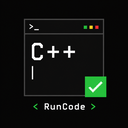

# RunCode

<p align="center">
  
</p>

> 专业、沉稳的 C++ 教学开发工具 — 轻量级跨平台 C++ 教学编辑器（macOS + Windows），专为 OI / 算法教学场景设计


## 特性

- **原生桌面体验** — macOS + Windows 双平台，Tauri 2 + Rust，无 Electron 包袱，体积小启动快
- **Monaco 编辑器** — VS Code 同款，教学友好的语法高亮 / 括号补全 / 代码补全，内置中文本地化
- **C++ 速查表** — 内置常用语法速查，快速查阅 STL 容器、算法、IO 等教学常用代码片段
- **多样例测试** — 一次性运行多组样例，支持按测试点勾选运行 / 全选一键切换，支持 stdin / expected 文件导入
- **时间限制判定** — 单例超时判失败（OI 友好，默认 1000ms，可配置）
- **实时终端** — PTY 终端支持交互式输入（macOS forkpty / Windows ConPTY）
- **代码格式化** — tree-sitter 解析 + 内置 formatter
- **控制流图可视化** — 将 C++ 函数的 if/else/for/while/switch 控制流自动渲染为 Mermaid 流程图，点击节点跳转对应代码行
- **Lyra 全直角风格** — Graphite 中性灰 + RunCode Slate 品牌交互色，UI 与代码统一 JetBrains Mono（详见 [ADR-0006](docs/adr/0006-runcode-brand-color-system.md)）
- **中英文界面切换** — 编辑器界面支持中 / 英双语
- **主题切换** — Dark / Light / System 跟随系统，支持自定义图片主题
- **可折叠面板** — 左右 / 上下分栏自由切换

## 性能与轻量化

基于 Tauri 2 + Rust，相比 Electron 方案显著轻量：

- **安装包体积**：~10MB 级（macOS DMG）/ ~40MB 级（Windows NSIS，含内置 TDM-GCC，安装后展开约 290MB）
- **运行内存**：主进程 ~35MB；完整实例（含 WebKit/WebView2 + Monaco）macOS ~260MB / Windows ~240MB（对比 Electron 同类应用通常 300MB+，仍更轻量）
- **启动时间**：秒级（冷启动 <1s）
- **无 Electron 包袱**：不打包 Chromium 内核，系统 webview 原生渲染

适合教学场景对资源占用敏感的机房环境。

## 快速开始

```bash
pnpm install
pnpm tauri dev
```

**平台要求**：

- macOS 11+（aarch64 / x86_64）
- Windows 10 1903+（x86_64）
- Node.js 22.13+（LTS）、pnpm、Rust toolchain（rustup）

**编译器**：

- macOS：自动探测 clang++（Xcode Command Line Tools）
- Windows：内置 TDM-GCC 10.3.0（无需另装）

## 构建

### macOS

```bash
# Ad-hoc 签名（开发用）
./scripts/build-dev.sh

# Developer ID 正式签名 + 公证
./scripts/build-signed.sh
```

### Windows

```powershell
# NSIS 安装包（含内置 TDM-GCC）
./scripts/build-windows.ps1
```

详见 [BUILD.md](./BUILD.md)。

## 文档

- [品牌指南](./docs/brand-guidelines.md)
- [构建与签名指南（macOS + Windows）](./BUILD.md)
- [AI 协作规范](./AGENTS.md)
- [架构决策记录 (ADR)](./docs/adr/README.md)

## 执行模型与安全说明

RunCode 以当前用户权限执行本地 C++ 代码，**不是恶意代码沙箱**。仅适合运行自己信任的本地教学代码。

**资源限制范围**：

- CPU 时间上限（防死循环）
  - macOS：RLIMIT_CPU
  - Windows：JobObject LIMIT_JOB_TIME
- 文件大小上限（防写爆磁盘）— 仅 macOS（RLIMIT_FSIZE），Windows 无等价 API
- 运行超时（硬杀进程）
- 测试时间限制（软判定，OI 评测用）

**不提供**：

- 内存限制（macOS RLIMIT_DATA/AS/RSS 无法生效，Windows 同样不实现）
- 沙箱隔离（不隔离文件系统访问、网络、子进程）
- 来源不明代码的安全审查

请勿运行来源不明的代码。如需运行陌生代码，请使用专用沙箱环境（如 Docker、虚拟机）。

## 字体

应用打包以下字体，开箱即用：

- **JetBrains Mono**（UI 与代码统一字体）：SIL Open Font License 1.1，见 [LICENSES/JetBrainsMono-OFL.txt](./LICENSES/JetBrainsMono-OFL.txt)

中文字形不打包，自动 fallback 到系统字体（PingFang SC / Hiragino Sans GB / Microsoft YaHei）。

## 第三方组件

- **TDM-GCC 10.3.0** (MinGW-w64 based) — GPLv3+，[源码](https://github.com/jmeubank/tdm-gcc-src)，[官方下载](https://jmeubank.github.io/tdm-gcc/)
  - libstdc++ 受 GCC Runtime Library Exception 保护，用户编译的程序不感染 GPL
  - 许可证文本：[LICENSES/TDM-GCC-GPLv3.txt](./LICENSES/TDM-GCC-GPLv3.txt) / [LICENSES/TDM-GCC-runtime.txt](./LICENSES/TDM-GCC-runtime.txt)
- **JetBrains Mono** — SIL Open Font License 1.1

## 推荐开发环境

- [VS Code](https://code.visualstudio.com/) + [Tauri](https://marketplace.visualstudio.com/items?itemName=tauri-apps.tauri-vscode) + [rust-analyzer](https://marketplace.visualstudio.com/items?itemName=rust-lang.rust-analyzer)

## 作者

**YuanMing**

## License

[MIT License](./LICENSE)
